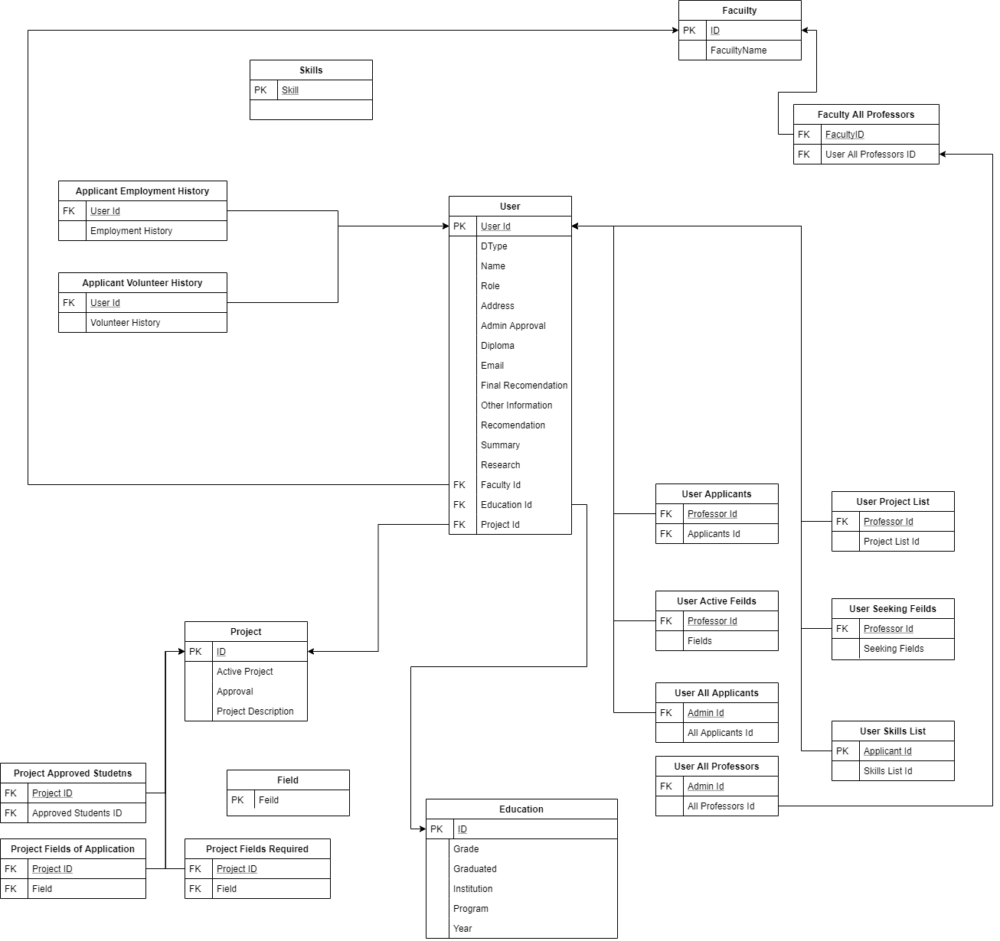

# GAMZ

SYSC 4806 Project
Graduate Management System
---------------------

Project Description:
--------------------------------
GAMZ is web application to manage graduate applications. Students are able to submit applications with relevant information. 
Professors are able to list their fields of research. The applications can then be filtered and reviewed by and administrator before forwarding them to the Professors for recommendations. The administrator can then make a final decision on the applicatons.

Team Leftovers1 - Group Members:

- Benjamin Bichel 100998411
- Thomas Carriere 100947281
- Fatima Hashi 101041794

Milestone 2 - Current Prototype:
------------------------------
The current deliverable implements:

- A main login view redirecting Users based on role 
- Multiple views for each type of User
- Applicant is able to submit an application
- Professor is able to submit an application
- Administrator is able to view all submitted applications

Instructions
-----------------------------
1. Run App.java class under Application package
2. Open a new browser and type http://localhost:8080/
3. You will be redirected to a Login page, select the role of your choosing.

Link to Heroku app --> https://gamz4806.herokuapp.com/

ER Mapping EntityManager
-----------------------------
.png)
DataBase Schema
-----------------------------

Milestone 3 - Next SCRUM Deliverables
-----------------------------
The next deliverable will implement:

- Administrators select applicant profiles & send to Professors
- Professor's home page will recieve notification
- Professor will submit an assesment 
- Administrator will submit a final decision
- Applicants will get notified of final decision

 
